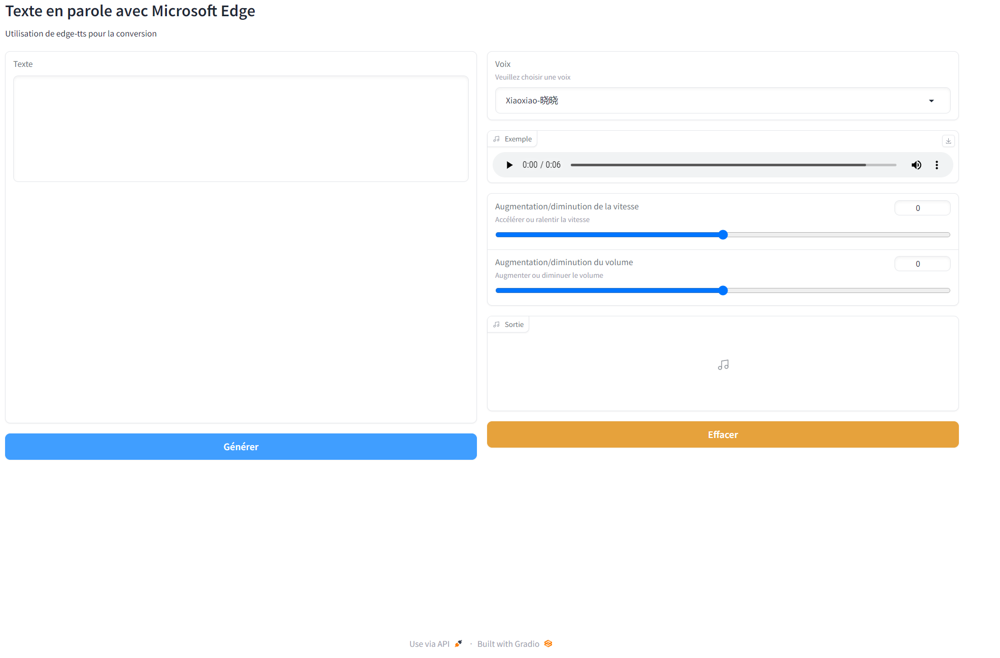

# edge-tts-webui-FR

`edge-tts-webui-FR` [edge-tts](https://github.com/rany2/edge-tts) est la version de l’interface web en Français de edge-tts, développée avec `gradio`.



## Installation

    pip install edge-tts
    pip install gradio
    pip install asyncio

## Exécution

    python app.py

## Utilisation

Accédez à l’application via votre navigateur en visitant
```
localhost:7860
```
